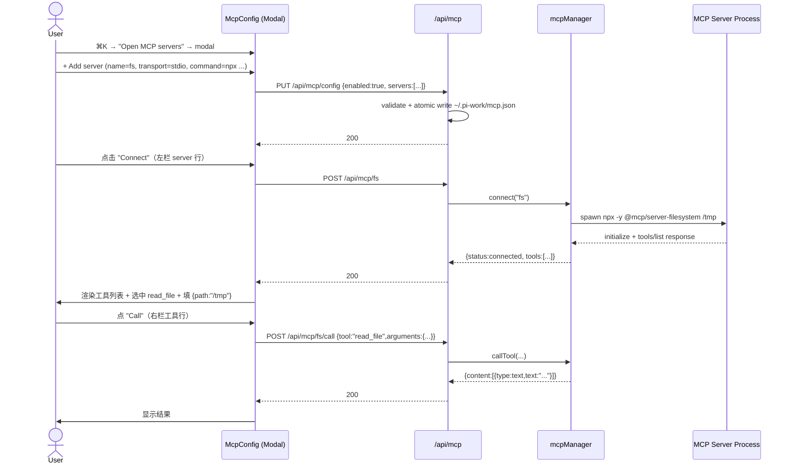

# MCP 集成方案 v1：仅做客户端 + 测试入口

> **状态：v1 范围已收窄**。本版本只交付一个独立的 MCP 客户端：**能连接 MCP 服务、能列工具、能手动调用工具**。**不**做注入到 pi agent 这一步（那是 v2 的事）。
>
> 后续如果 v1 跑通了，再单独写 v2 设计文档把 MCP tools 转成 `customTools` 注入 pi。

---

## 1. 目标与非目标

**v1 目标**

1. 读写独立的 `~/.pi-work/mcp.json`，CRUD 一组 MCP server 配置。
2. 提供一个**独立的进程内 MCP 客户端管理器** `lib/mcp/manager.ts`：能按 server name 连接、列出工具、调用工具、断开。
3. 提供 **REST API + 一个 UI 面板**让人能手动：保存配置 → 连一个 server → 看 tools 列表 → 选一个工具 + 填 JSON 参数 → 看返回结果。

**非目标（v1 不做）**

- **不暴露给 pi agent**。`lib/rpc-manager.ts` 不改，`createAgentSession({ customTools })` 不动。
- 不做 JSON Schema → TypeBox 转换（不需要，因为不进 pi 的 tool 系统）。
- 不做权限/policy、超时策略自动注入。
- 不做 OAuth / dynamic client registration。
- 不做 MCP resource / prompt / sampling（v1 只用 `listTools` + `callTool`）。
- 不做 streaming call（v1 SDK client 也不普遍支持）。
- 不做 server 状态持久化（重启后所有连接断，需要 UI 手动重连）。

---

## 2. 现状关键约束（决定设计走向）

| 约束 | 出处 | 影响 |
|---|---|---|
| 项目配置已经统一走 `~/.pi-work/config.yaml`，但又有独立 JSON 配置文件先例 | `lib/config.ts` / `lib/todo-tools-config.ts` (`~/.pi-work/todo-tools.json`) | MCP 走独立 JSON 文件 `~/.pi-work/mcp.json`，与 yaml 主配置解耦——内容多增删频繁，不污染 yaml；与 `todo-tools.json` 的"按内容切片的小配置"风格一致 |
| 三个独立模态框已经有标准模板（Models / Skills / Prompts） | `components/{Models,Skills,Prompts}Config.tsx` + `components/AppShell.tsx` 挂载模式 | MCP UI 走"第四个独立模态框"，复用同模板而不是嵌进 SettingsModal |
| pi agent 这条路已经被刻意区分（运行时冻结） | `lib/rpc-manager.ts:362` 注释 | v1 绕过这条路；v2 单独写 |
| Node ≥ 22，`fetch` 内置 | `package.json#engines` | `StreamableHTTPClientTransport` 不需要 `eventsource` polyfill |
| 用户侧 token 等敏感字段已经有 env placeholder 习惯（看后续 decide） | 无 | 不强制，但建议引入 `${VAR}` 占位符 |

---

## 3. 依赖

新增一个依赖：

```jsonc
// package.json → dependencies
"@modelcontextprotocol/sdk": "^1.30.0"
```

只 import 三个子包，tree-shakable：

```ts
import { Client } from "@modelcontextprotocol/sdk/client/index.js";
import { StdioClientTransport } from "@modelcontextprotocol/sdk/client/stdio.js";
import { StreamableHTTPClientTransport } from "@modelcontextprotocol/sdk/client/streamableHttp.js";
```

> 不引 server / auth 子包。`eventsource-parser` 等传递依赖会被 npm flat 安装。

---

## 4. 数据模型

### 4.1 JSON 文件形状

独立文件 `~/.pi-work/mcp.json`（不复用 `config.yaml`）：

```jsonc
// ~/.pi-work/mcp.json
{
  "enabled": true,
  "servers": [
    {
      "name": "filesystem",
      "enabled": true,
      "transport": "stdio",
      "command": "npx",
      "args": ["-y", "@modelcontextprotocol/server-filesystem", "/tmp"],
      "env": { "DEBUG": "1" },
      "cwd": "/home/alone",
      "timeout_ms": 30000
    },
    {
      "name": "notion",
      "enabled": true,
      "transport": "http",
      "url": "https://mcp.example.com/notion",
      "headers": {
        "Authorization": "Bearer ${NOTION_TOKEN}"
      },
      "timeout_ms": 30000
    }
  ]
}
```

**为什么独立 JSON 文件**

- 配置量会随 server 数线性增长，单文件独立维护 / 备份 / git-ignore 都更方便。
- 不污染 `config.yaml`，避免 SettingsModal 与 MCP modal 同时改 yaml 时的合并冲突。
- 与已有的 `~/.pi-work/todo-tools.json` / `~/.pi-work/favorites.json` / `~/.pi-work/pinned.json` 风格一致——它们都是按内容切片的小 JSON 文件，`lib/json-array-store.ts` 已给出读写基础 helper。

**约定**

- `name` 在整个文件必须唯一（UI 用它定位一个 server）。
- `headers` / `env` 值里允许 `${VAR}` 占位符，按 `process.env` 替换；找不到则该键整段跳过并 `log.warn`，避免在 JSON 明文保存 token。
- 顶层 `{ enabled: false, servers: [] }` 是 fail-open 默认值（与现有 `todo-tools.json` 行为一致：文件不存在 / 损坏 → 回退默认）。
- 文件格式不向前兼容失败时不影响启动：先记 `log.warn`，UI 用空状态显示。

### 4.2 类型与默认值

```ts
// lib/mcp/types.ts
export type McpTransport = "stdio" | "http";

export interface McpStdioServerConfig {
  enabled: boolean;
  transport: "stdio";
  command: string;
  args?: string[];
  env?: Record<string, string>;
  cwd?: string;
  timeout_ms?: number;
}

export interface McpHttpServerConfig {
  enabled: boolean;
  transport: "http";
  url: string;
  headers?: Record<string, string>;
  timeout_ms?: number;
}

export type McpServerConfig = McpStdioServerConfig | McpHttpServerConfig;

export interface McpConfig {
  enabled: boolean;
  servers: McpServerConfig[];
}

export const DEFAULT_MCP_CONFIG: McpConfig = {
  enabled: false,
  servers: [],
};
```

**不**并入 `lib/config.ts`，类型 / 解析 / 默认值都只在 `lib/mcp/` 子目录下，client bundle 仅通过 `lib/mcp/mcp-client-types.ts` 这个客户端安全壳子引用必要常量。

---

## 5. 客户端管理器

### 5.1 形状

`lib/mcp/manager.ts` 暴露一个模块级单例 `mcpManager`，挂在 `globalThis` 上（与 `lib/rpc-manager.ts` 的 `__piSessions` 同款，避免 Next.js hot-reload 丢状态）：

```ts
interface McpServerHandle {
  name: string;                                  // server name
  status: "connecting" | "connected" | "error" | "disconnected";
  error?: string;                                // status === "error" 时的人类可读原因
  transport: McpTransport;
  client: Client;                                // MCP SDK Client
  tools: McpToolInfo[];                          // 最近一次 listTools 的快照
  connectedAt?: number;                          // epoch ms
}

interface McpToolInfo {
  name: string;
  description?: string;                          // 经过长度截断（≤ 4 KiB）
  inputSchema: unknown;                          // raw JSON Schema，UI 原样回显 + 提示用户填表单
}
```

API：

```ts
mcpManager.listServers(): McpServerView[];                         // 来自 yaml，不建连
mcpManager.connect(name: string): Promise<McpServerHandle>;        // 同步起一个新连接（10s timeout）
mcpManager.disconnect(name: string): Promise<void>;                // 显式断开
mcpManager.listTools(name: string, opts?: {refresh?: boolean}):
  Promise<McpToolInfo[]>;                                          // 默认缓存，refresh=true 强制重 listTools
mcpManager.callTool(name: string, toolName: string, args: unknown):
  Promise<{content: McpContent[]; isError?: boolean}>;             // 单次调用，带 timeout
mcpManager.getStatus(name: string): McpServerHandle | undefined;   // 不建连，只看
```

### 5.2 行为约束

- **没有自动后台连接**：UI 触发 `connect` 才连；连接空闲 5 分钟后自动 `disconnect`（模块级 `setTimeout`，每次 `callTool` 重置）。Reasoning：v1 是手动测试，不需要 24h keep-alive。
- **`connect` 失败 = 不抛 panic**：`Promise.reject` 给 UI，但 manager 不保留半坏的 handle。如果 `client.connect()` 或首个 `listTools` 在 10 s 内没 ready → 拒绝该 promise，UI 显示 `error: ...`，其它 server 无影响。
- **`callTool` 错误**：MCP 的 `isError: true` result 当作 200 返回给 UI（让 UI 区分"成功但报错"和"连接失败"）；transport / protocol 级错误才 → reject。
- **并发安全**：单个 `name` 同时只能有一个 handle。`connect(name)` 时若已有 handle，直接返回现有；后台有 inflight 建连则返回同一 promise（沿用 `__piStartLocks` 同款）。

### 5.3 连接步骤

```
connect(name):
  1. 从 readConfig() 读当前 server 配置（每 connect 都读——用户可能在 UI 里刚改过 yaml）
  2. enabled === false → reject("server disabled")
  3. 按 transport new Transport:
       stdio:   new StdioClientTransport({ command, args?, env?, cwd? })
                env 做 ${VAR} 替换
       http:    new StreamableHTTPClientTransport(new URL(url), { requestInit: { headers } })
                headers 做 ${VAR} 替换
  4. new Client({ name: "pi-work-mcp", version: <pkg.version> }, { capabilities: {} })
  5. await Promise.race([ client.connect(transport), timeout(10_000, "connect-timeout") ])
  6. 立刻走一次 client.listTools()，把 result.tools 缓存到 handle.tools
  7. handle.status = "connected"；注册 idle timer
  8. catch → handle.status = "error"; handle.error = message; close transport
  9. finally → throws
```

### 5.4 进程清理

- Node 进程 `exit / SIGINT / SIGTERM`：`globalThis` 上挂的 manager 跑一遍 `disconnectAll()`。
- Stdio transport 关闭 → 子进程自然挂；HTTP transport 无副作用。
- 5 min idle timer 在每次 `callTool` / `listTools` 时重置。

---

## 6. 文件清单

新增：

```
lib/
  mcp/
    manager.ts                 # McpManager 单例 + 全部方法（核心）
    transport.ts               # buildTransport(server) → MCP Transport + ${VAR} 占位符替换
    config-store.ts            # readMcpConfig() / writeMcpConfig() → ~/.pi-work/mcp.json
                               # 模仿 lib/todo-tools-config.ts 的 fail-open 形态
    types.ts                   # McpConfig / McpServerConfig / McpServerView / McpToolInfo
    mcp-client-types.ts        # 客户端安全子集：DEFAULT_MCP_CONFIG 等常量，避免 client bundle 引 fs/path
app/
  api/
    mcp/
      config/route.ts          # GET / PUT 整体读写 ~/.pi-work/mcp.json
      route.ts                 # GET /api/mcp — 列 server view（不建连，带 status）
      [name]/route.ts          # POST = connect；DELETE = disconnect
      [name]/tools/route.ts    # GET 返回缓存；?refresh=1 强制重 list
      [name]/call/route.ts     # POST { tool, arguments } → callTool
```

修改：

- `components/McpConfig.tsx` —— 独立模态框，形态对齐 `ModelsConfig.tsx`（`{ onClose: () => void }`）。内部分两栏：
  - 左：server 列表 + Connect / Disconnect + status chip + Add（行内展开添加表单）
  - 右：当前选中 server 的 tool 列表 + JSON 文本框填 arguments + Call 按钮 + result 视图
- `components/AppShell.tsx` —— 加 `mcpConfigOpen` state、`openMcp` 进 `commandContext`、末尾 `{mcpConfigOpen && <McpConfig onClose={...} />}` 挂载（与 ModelsConfig / SkillsConfig / PromptsConfig 完全同款）。
- `lib/commands.tsx` —— `CommandContext` 加 `openMcp` 字段；`group: "Modal"` 段加 `modal.mcp` 命令（`when: () => true`，配置全局，不限定 cwd）。Title 取 `t("Open MCP servers")`，keywords 含 `"mcp" / "model context protocol" / "MCP"`。
- `hooks/useMcpClient.ts` —— `fetch` 包装；暴露 `listServers() / connect(name) / disconnect(name) / listTools(name, opts?) / callTool(name, tool, args) / getConfig() / saveConfig(cfg)`。
- `hooks/useI18n.tsx` —— 加所有新 UI 文案的 i18n key（中文 locale 必填）。

**不变更**

- `lib/config.ts` / `app/api/settings/route.ts`：`PiWorkConfig` 保持不变，MCP 配置与 yaml 完全解耦。
- `SettingsModal.tsx`：完全不进。
- 右栏按钮 / `TabBar`：完全不变。

---

## 7. REST API

### 7.1 配置读写

#### `GET /api/mcp/config`

读 `~/.pi-work/mcp.json`，返回 `{enabled, servers[]}`。**不建连**。

```jsonc
// 200
{ "enabled": true, "servers": [ {name, enabled, transport, ...}, ... ] }

// 文件不存在 / 损坏 → 200 + {enabled:false, servers:[]}，绝不报 500
// (与 lib/todo-tools-config.ts 的 fail-open 同款)
```

#### `PUT /api/mcp/config`

整体替换写入。Request body = 完整 `McpConfig`：

- 写前做严格校验（reject 400 + 具体错误信息）：
  - `enabled` 必须 boolean；`servers` 必须数组。
  - 每个 server `name` 必填 + 唯一（重复 → 400）。
  - `transport` ∈ `{"stdio","http"}`，其它值 → 400。
  - `transport=stdio` 必须有 `command`；`transport=http` 必须有 `url`（且能 parse 成 URL）。
  - `timeout_ms` 可选；如有必须正整数，越界则 clamp + log.warn（与 `lib/config.ts#parseFileViewerMaxSizeMb` 一致）。
- 校验通过 → 原子写：先 `writeFileSync('<path>.tmp')` 再 `rename`（避免半写损坏原文件）。写完不主动 reload manager——manager 在下一次 connect / listTools 时 lazy 重读。

### 7.2 状态查询：`GET /api/mcp`

返回每条 server 的 view（从 manager 拿 status，不建连）：

```jsonc
{
  "enabled": true,
  "servers": [
    {"name":"filesystem","transport":"stdio","enabled":true,"status":"disconnected"},
    {"name":"notion","transport":"http","enabled":true,"status":"connected","tools":14}
  ]
}
```

`status ∈ {"connecting","connected","error","disconnected"}`；没有 handle → `"disconnected"`。

### 7.3 连接管理：`POST /api/mcp/[name]` 与 `DELETE /api/mcp/[name]`

#### `POST /api/mcp/[name]`

触发 connect。body 可选 `{ "timeoutMs": 10000 }`。返回 `McpServerView`（带 `tools` 数组）。

- `200`：成功，`status: "connected"`，`tools` 已填充。
- `4xx/5xx`：`{ error: string }`，UI 显示在 status chip 上。

#### `DELETE /api/mcp/[name]`

断开连接。无 body。

### 7.4 工具列表：`GET /api/mcp/[name]/tools?refresh=0|1`

返回 `McpToolInfo[]`。`refresh=1` 时先 `listTools` 后返回（写回缓存）。

### 7.5 工具调用：`POST /api/mcp/[name]/call`

```jsonc
// request
{ "tool": "read_file", "arguments": { "path": "/etc/hostname" } }

// 200 OK
{
  "isError": false,
  "content": [
    {"type":"text","text":"my-hostname\n"},
    {"type":"image","mimeType":"image/png","data":"<base64>"}
  ]
}

// 200 with isError
{ "isError": true, "content": [{"type":"text","text":"path not found"}] }

// 4xx/5xx → connection-level error
{ "error": "server not connected; POST /api/mcp/filesystem first" }
```

`arguments` 是任意 JSON（MCP 透传），不做 schema 校验。失败时 UI 直接把 `e.message` 显示出来。

---

## 8. UI 形态：独立模态框

和 `ModelsConfig` / `SkillsConfig` / `PromptsConfig` 同形态 —— **一个独立的居中模态框**，通过 ⌘K 命令面板打开，不进 `SettingsModal` 也不进右栏。

### 8.1 组件形态

`components/McpConfig.tsx`：

```ts
export function McpConfig({ onClose }: { onClose: () => void }) {
  // 自身维护：config / handles / selectedName / selectedTool / argsText / callResult
  // 不需要 cwd：MCP 配置在 ~/.pi-work/mcp.json 是全局的
  // 不接任何 callback props；自己 fetch /api/mcp/* 即可
}
```

弹层结构（与 `ModelsConfig.tsx:1068` 同款 backdrop + 居中卡片）：

```
┌─ MCP Servers ──────────────────────────────────────┐
│ 左栏 (≈ 38%)                  │ 右栏 (≈ 62%)       │
│ ┌─ enabled 总开关 ─────────┐  │ ┌─ 当前选中 server ┐│
│ │ [+ Add server]          │  │ │ status chip       ││
│ │                          │  │ │ [Connect] [Disc..] ││
│ │ filesystem   ●connected │  │ │                    ││
│ │   stdio      tools: 5    │  │ │ Tools (5)          ││
│ │ notion       ✕ error     │  │ │  • read_file       ││
│ │ ...                      │  │ │  • write_file      ││
│ │                          │  │ │  ...               ││
│ │ selected: filesystem     │  │ │                    ││
│ └──────────────────────────┘  │ │ Tool: read_file    ││
│                                │ │ arguments (JSON):  ││
│ 添加表单 (抽屉，点击 [+ Add]):│ │ ┌────────────────┐ ││
│ ┌────────────────────────┐    │ │ │ { "path": ... } │ ││
│ │ name   transport       │    │ │ └────────────────┘ ││
│ │ stdio: command/args/env│    │ │ [Call]             ││
│ │ http:  url/headers     │    │ │ ─── result ───     ││
│ │ [Save] [Cancel]        │    │ │ {type:text,text:..}││
│ └────────────────────────┘    │ └────────────────────┘│
└────────────────────────────────────────────────────┘
```

注：`/` 居中布局通过 `display: "flex", flex: 1`，与 `ModelsConfig.tsx` 已用的左右分栏一致。

### 8.2 触发入口

| 入口 | 说明 |
|---|---|
| ⌘K 命令面板 | 输入 `mcp` / `Open MCP servers` 触发，见 8.3 |
| 头像菜单（可选） | 与 Scheduler / Settings 平级，参考 `SchedulerModal` 的入口 |

v1 **不做**右栏 `MCP Tester` 面板，不进 `SettingsModal` 段落。

### 8.3 命令面板注册

`lib/commands.tsx` 的 `group: "Modal"` 段追加：

```ts
cmds.push({
  id: "modal.mcp",
  title: t("Open MCP servers"),
  group: "Modal",
  keywords: ["mcp", "model context protocol", "servers", "MCP", "外部工具"],
  icon: <McpIcon />,                              // 新增 16×16 SVG icon
  when: () => true,                               // 配置全局，不限定 cwd
  run: () => ctx.openMcp(),
});
```

`CommandContext` 接口加 `openMcp: () => void`，`components/AppShell.tsx` 在 `commandContext` 里实现：`openMcp: () => setMcpConfigOpen(true)`。

### 8.4 AppShell 挂载点

`components/AppShell.tsx` 三处增量（与既有三模态框完全同模板）：

```ts
// 1. 顶部 useState 段
const [mcpConfigOpen, setMcpConfigOpen] = useState(false);

// 2. commandContext 里
openMcp: () => setMcpConfigOpen(true),

// 3. 末尾挂载点（在 <ModelsConfig /> 旁边）
{mcpConfigOpen && <McpConfig onClose={() => setMcpConfigOpen(false)} />}
```

不修改 `SettingsModal.tsx`、`useTheme`、`TabBar`、右栏按钮 ID。

---

## 9. 启动流程（用户视角）



---

## 10. 风险与边界

| 风险 | 处理 |
|---|---|
| 用户在 UI 里刚改 yaml，下一次 connect 拿到的是旧值 | `connect()` 每次重新读 `readConfig()` |
| stdio 子进程挂死 | `StdioClientTransport.close()` 杀子进程；handle.error 写入状态；UI 显示 `disconnected` + `error: child exited` |
| HTTP 401 / 5xx | 透传 SDK 抛出的 error message；UI 显示在 status chip |
| 用户传超大 arguments | v1 不限大小；交由 MCP server 自己拒绝（一般都有 limit）。后续可加 N KiB 上限 |
| MCP server 返回的图片 / blob | UI 显示缩略图 + base64 size；原始 data 不进 yaml |
| `name` 含 `/` 等特殊字符无法做 URL segment | API 里用 `encodeURIComponent`，UI 不允许输入 `/` |
| 5 min idle 后断 → 用户敲了 call 又失败 | `callTool` 内部 detect → 自动 reconnect → 重试一次；最终失败才往外抛 `reconnected-then-failed` |
| 并发 `connect("same")` | `globalThis.__mcpStartLocks` 锁；返回同一 promise |

---

## 11. 不在 v2（明确推迟）

- JSON Schema → TypeBox 转换。
- 把 MCP tools 转成 pi `ToolDefinition` 注入 `customTools`（写 v2 设计文档时专门讨论命名空间、promptGuidelines 注入、AgentSession 生命周期、system prompt 预算）。
- per-server / per-tool 权限开关。
- MCP resource / prompt / sampling / roots / elicitation 客户端支持。
- OAuth 2.1 / dynamic client registration。
- 后台守护进程模式（连接常驻）。
- 工具调用历史 / 持久化（v1 用完就丢）。

---

## 12. 验证清单

- [ ] `npm run dev` 起；把一个 stdio MCP server（例如 `@modelcontextprotocol/server-filesystem`）写到 yaml；UI 列表能看到。
- [ ] 点击 `Test` → `Connect` → `Connect` 转 `connected`，显示 tools 列表（≥ 1 个）。
- [ ] 选一个工具，填 JSON，`Call` → result 视图显示内容。
- [ ] 切断网络 / 杀 server 子进程 → status 变 `error: ...`；UI 不崩。
- [ ] `Disconnected` 后 5 分钟 idle timer 触发后子进程被 kill（`ps aux \| grep` 验证）。
- [ ] `PUT /api/mcp/config` 时缺 `command` / 缺 `url` → 400 + 字段名错误信息。
- [ ] `name` 重复 → 400 拒绝；第二个同名 server 不入文件。
- [ ] `~/.pi-work/mcp.json` 写为半截（断电/进程被杀）下次启动不崩：atomic write `.tmp` + `rename`，老文件保留。
- [ ] 手动删 `~/.pi-work/mcp.json` 再 GET `/api/mcp/config` → 200 + `{enabled:false, servers:[]}`，UI 显示空列表，不报 500。
- [ ] 手动把 JSON 写成 `{"this is not valid"}`：fail-open 回默认，UI 顶部一条 `Config file is corrupt; defaults restored.` 提示。
- [ ] `tsc --noEmit` 通过；`eslint lib/mcp hooks/useMcpClient.ts components/McpConfig.tsx` 通过。
- [ ] client bundle（`.next/static`）grep `modelcontextprotocol` 为空——所有 MCP 类型从 `lib/mcp/mcp-client-types.ts` 这个客户端安全子集进 client。
- [ ] v2 阶段的入口已经预留：`lib/mcp/manager.ts` 暴露 `getHandle(name).tools` 等纯函数，v2 直接 map 成 `ToolDefinition`，不需要重写。

---

## 13. 预估代码量

| 模块 | 行数（含注释） |
|---|---|
| `lib/mcp/manager.ts` | ~200 |
| `lib/mcp/transport.ts` | ~50 |
| `lib/mcp/config-store.ts` | ~50（仿 `lib/todo-tools-config.ts`，含 fail-open） |
| `lib/mcp/types.ts` | ~30 |
| `lib/mcp/mcp-client-types.ts` | ~10 |
| `app/api/mcp/config/route.ts` | ~80（validate + atomic write） |
| `app/api/mcp/route.ts` + `[name]/...` 4 个 | ~180 |
| `lib/config.ts` / `app/api/settings/route.ts` | **0 行**（不变更） |
| `hooks/useMcpClient.ts` | ~80 |
| `components/McpConfig.tsx` | ~280（CRUD + 测试 + 左右分栏） |
| `components/AppShell.tsx` 增量 | ~6（state + openMcp + 挂载） |
| `lib/commands.tsx` 增量 | ~12（CommandContext 字段 + Modal 段推一条命令 + 一个 icon） |
| `hooks/useI18n.tsx` 增量 | ~30 |
| **合计** | **~1008 行** |

其中后端 ~600 行，前端 ~408 行。**没有一行进入 `lib/config.ts` / `app/api/settings/route.ts` / `lib/rpc-manager.ts`**——MCP 与 yaml 主配置、与 pi agent 都完全解耦，v2 单独再议。
